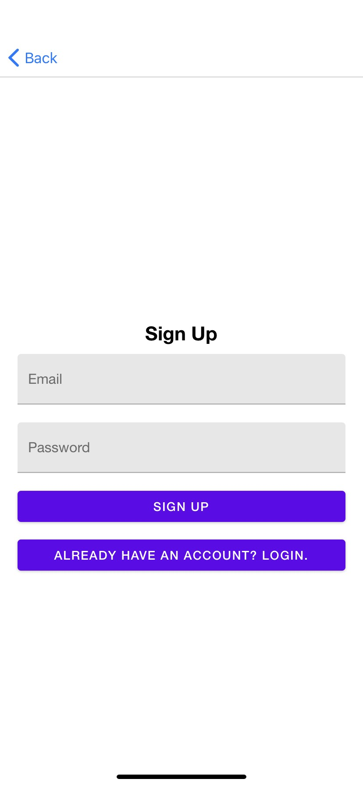

# Project Glucose Tracker
**Team Name:** Code Bashers

**Project Owner:** Kawsar Project

**Team Members:** Aaron Barlow, David Beverley, Grant Watson, Josiah Smythe, Justin Cathelyn, and Thomas Burtner

**Scrum Master:** David Beverley

**Product Owners:** Aaron Barlow & Josiah Smythe

## Brief Description
Patients submit their food intake, blood glucose level and exercise information from their phone applications and doctors can view those information graphically from a phone application or web app

## Languages, Frameworks, and Libraries
**Languages:** JavaScript & CSS

**Frameworks:** React & React Native

**Libraries:** React Native Paper, Firebase, DataTable, React Timeseries Charts, React Native Chart Kit, React Icons, and Pond.js

## Running Mobile and Web App
		Pre-Conditions: Must have node.js install and have the expo app on your phone
		   https://facebook.github.io/react-native/docs/getting-started.html
		   https://nodejs.org/en/download/

		Mobile:
		   1) Download the glucose tracker zip file and extract it
		   2) In file explorer inside of the GlucoseTracker file and type cmd in the top bar
		   3) Install react by running the command “npm install react-native"
		   4) Once installed run the command “npm start”
		   5) After a short while, there should be a QR code. Scan the code with the expo app for Android or with the camera app for iPhone
		   6) Allow the application to build and it will start automatically

		Web:
		   1) Download the glucose tracker zip file and extract it
		   2) In file explorer inside of the GlucoseTracker\web and type cmd in the top bar
		   3) Install react by running the command “npm install react-native"
		   4) Once installed run the command “npm start”
		   5) The application will build and then open up in your web browser

### Mobile ScreenShots
Patient Login             |  Patient SignUp
:-------------------------:|:-------------------------:
  |  

### Web ScreenShots

